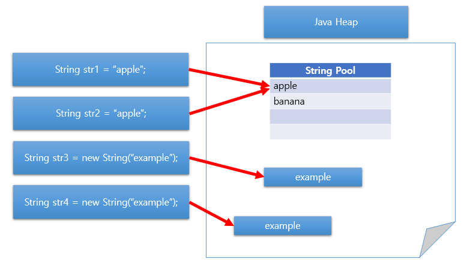

# What is the difference between the equals() and == operators in Java?
## equals() vs. ==
> `==` : 주소값을 비교<br>
> `equals()` : 데이터 값을 비교
<br>

> Java에서 `int와 boolean과 같은 일반적인 데이터 타입`의 비교는 '=='이라는 연산자를 사용하여 비교한다.
> <br>
> `String처럼 class`의 값을 비교할 때는 'equals()'라는 메소드를 사용하여 비교한다.

<br>

### String 변수 생성 시 주소 할당
String 변수를 생성할 때는 두 가지 방법이 있다.
> 1. 리터럴을 이용한 방식
> 2. new 연산자를 이용한 방식

```java
//리터럴
String str1 = "apple";
String str2 = "apple";

//new 연산자
String str3 = new String("example");
String str4 = new String("example");

```
<br>

#### 1. 리터럴
- `String Constant Pool`이라는 영역에 존재하게 된다.
- 리터럴로 선언할 경우 내부적으로 String의 intern() 메서드가 호출되고 intern() 메서드는 주어진 문자열이 String Constant Pool에 존재하는지 검색한다. 존재한다면 그 **주소값을 반환**하고 없다면 String Constant Pool에 넣고 새로운 주소값을 반환한다.

#### 2. new 연산자
- new를 통해 String을 생성하면 `Heap 영역`에 존재하게 된다.

<br>



<br>

### == 연산자

```java
class Compare {
    public static void main(String[] args) {
        String s1 = "abcd";
        String s2 = new String("abcd");

        if (s1 == s2) {
            System.out.println("같은 값입니다.");
        } else {
            System.out.println("다른 값입니다.");
        }
    }
}
```

```java
다른 값입니다.

Process finished with exit code 0
```

리터럴과 new 연산자를 ==로 비교하면 두 값은 다르다는 결론이 나온다. 주소값을 비교하는 == 연산자의 경우 변수들이 동일한 객체를 참조하는지 확인한다. 참조 타입 변수의 값은 Heap 영역의 객체 주소이므로 s1과 s2는 같은 데이터 값을 가지지만 결국 주소값이 다른 것이 확인되어 다른 값이라는 결과가 도출된다.

<br>

### equals()

```java
class Compare {
    public static void main(String[] args) {
        String s1 = "abcd";
        String s2 = new String("abcd");

        if (s1.equals(s2)) {
            System.out.println("같은 값입니다.");
        } else {
            System.out.println("다른 값입니다.");
        }
    }
}
```
```java
같은 값입니다.

Process finished with exit code 0
```

데이터 값을 비교하는 equals()의 경우 생성 방법에 따라 결과가 달라지지 않고 데이터 값을 정확하게 비교할 수 있다. equals()는 먼저 객체의 주소 값을 비교한 후 주소 값이 다르다면 String 문자열을 Char 타입으로 하나씩 비교해본다. 끝까지 같다면 같은 값으로 결과를 도출한다.