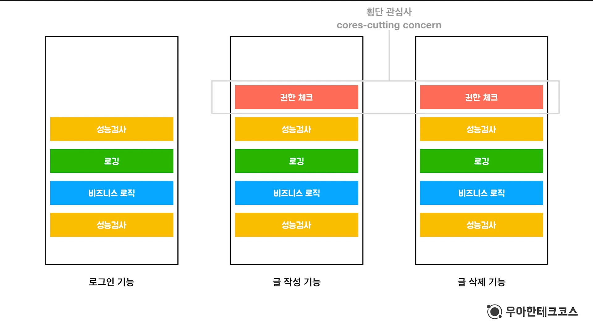

# What is Spring Framework in Java? 스프링 프레임워크

 

> 스프링 프레임워크는 모던 Java 기반 엔터프라이즈 애플리케이션을 위한 포괄적인 프로그래밍 및 구성 모델을 제공한다. 
> Spring은 개발 프로세스를 단순화하고 느슨한 결합, 의존성 주입 및 관점지향 프로그래밍과 같은 우수한 프로그래밍 사례를 증진하는 것을 목표로 한다.

 

#### 의존성 주입(DI)

- Spring은 개체가 내부적으로 생성되는 것이 아니라 종속성과 함께 제공되는 의존성 주입을 사용하게 한다.
- 이것은 클래스 간의 결합을 줄이고 코드를 더 유지, 보수 및 테스트할 수 있게 한다.

 

#### 제어의 역전(IoC)

- IoC는 프레임워크가 애플리케이션의 흐름을 제어하여 객체의 생성 및 생명 주기를 관리하게 하고 구성요소 간의 느슨한 결합을 제공할 수 있도록 하는 설계 원칙이다.

 

#### AOP(Aspect-Oriental Programming, 관점지향 프로그래밍)

- AOP는 개발자에게 `횡단관심사`(로깅, 보안, 트랜잭션 관리)을 별도의 모듈로 모듈화하여 코드 중복을 줄이고 유지보수성을 향상시킬 수 있다.
- `횡단관심사(cross-cutting concern)` :  
    

 

#### Spring MVC

- Spring은 웹 애플리케이션 구축을 위한 강력한 Model-View-Controller(MVC) 프레임워크를 제공한다.
- HTTP 요청 처리, 컨트롤러 관리 및 뷰 렌더링을 위한 구성 요소를 제공한다.

 

#### Spring Data

- 관계형 데이터베이스, NoSQL 데이터베이스 등 다양한 데이터 소스와 작업할 수 있는 일관된 통합 API를 제공하여 데이터 액세스 및 조작을 간소화한다.

 

#### Spring Security

- 이 모듈은 Java 애플리케이션 보안을 위한 강력한 보안 프레임워크를 제공한다.
- 일반적인 보안 위협으로부터 보호하기 위한 인증, 권한 부여 및 다양한 메커니즘과 같은 기능을 제공한다.

 

#### Springboot

- Springboot는 Spring 기반의 애플리케이션의 부트스트래핑과 설정을 간소화하는 데 목적을 둔 Spring Framework의 서브프로젝트이다.
- 개발자가 최소한의 노력으로 생산 준비가 된 애플리케이션을 빠르게 설정할 수 있도록 `CoC(Convention-over-Configuration)`를 제공한다.

 
 

Spring Framework의 모듈식 아키텍쳐는 개발자가 자신의 프로젝트에 필요한 특정한 모듈을 선택할 수 있게 해주며, 다른 애플리케이션의 요구에 따라 확장하고 적응할 수 있도록 만들어준다.