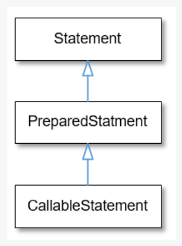

# JDBC

<br>

- Java Database Connectivity
- Java 애플리케이션이 관계형 데이터베이스와 상호작용 할 수 있는 표준 방법을 제공하는 Java 기반 API.
- 개발자는 JDBC로 데이터베이스 연결, SQL 쿼리 실행, 결과 검색, Java 애플리케이션 내의 데이터베이스 트랜잭션을 관리할 수 있다.


<br>

### 1. 드라이버 관리자

- 드라이버 관리자 클래스는 데이터베이스 드라이버 목록을 관리한다.
- 사용 가능한 드라이버에서 적절한 드라이버를 선택하여 적절한 데이터베이스에 대한 연결을 설정하는 것을 도와준다.

<br>

### 2. 데이터베이스 드라이버 

- JDBC 드라이버는 MySQL, PostgreSQL, Oracle 등과 같은 특정한 타입의 데이터베이스와 연결하기 위해 필요한 방법을 제공하는 플랫폼 특성화된 실행을 한다.
- 4가지 타입의 JDBC 드라이버가 있다.
  - Type1(JDBC-ODBC bridge)
  - Type2(Native-API)
  - Type3(Network Protocol)
  - Type4(Thin/Native Protocol)

<br>

### 3. 연결

- 커넥션 인터페이스는 데이터베이스로의 연결에 해당한다.
- 데이터베이스로의 연결을 관리하고 Statement, PreparedStatement, CallableStatement 객채를 생성하는 메서드를 제공한다.


<br>

### 4. Statement

- Statement interface는 데이터베이스에서 SQL 쿼리를 실행시키는 데 사용된다.
- 세 가지 주요 타입의 statement가 있다.:
  - Statement(일반 SQL문)
  - PreparedStatement(매개변수가 있는 미리 컴파일된 statement)
  - CallableStatement(저장된 프로시저(절차)를 호출)

<br>



서브 인터페이스로 내려갈 수록 향상된 기능을 제공한다.

<br>

### 5. ResultSet

- ResultSet 인터페이스는 DB 쿼리의 결과 셋을 보여준다.
- 쿼리에 의해 반환된 데이터를 검색하고 조작할 수 있다.


<br>

### 6. SQLException

- SQLException은 데이터베이스 관련 에러를 처리하기 위해 특별히 설계된 자바의 예외 클래스이다.
- DB와 상호작용하는 모든 JDBC 메서드들은 SQLException을 던질 수 있으므로 적절한 에러 처리가 필수적이다.

<br>
<br>

JDBC가 데이터베이스에 어떻게 연결되고, 쿼리를 실행, 결과를 검색하는지 예제 코드

<BR>

```java
import java.sql.*;

public class JDBCDemo {
  public static void main(String[] args) {
    String jdbcUrl = "jdbc:mysql://localhost:3306/mydatabase";
    String username = "user";
    String password = "password";

    try (Connection connection = DriverManager.getConnection(jdbcUrl, username, password)) {
      Statement statement = connection.createStatement();
      ResultSet resultSet = statement.executeQuery("SELECT * FROM employees");

      while (resultSet.next()) {
        String name = resultSet.getString("name");
        int age = resultSet.getInt("age");
        System.out.println("Name: " + name + ", Age: " + age);
      }
    } catch (SQLException e) {
      e.printStackTrace();
    }
  }
}
```