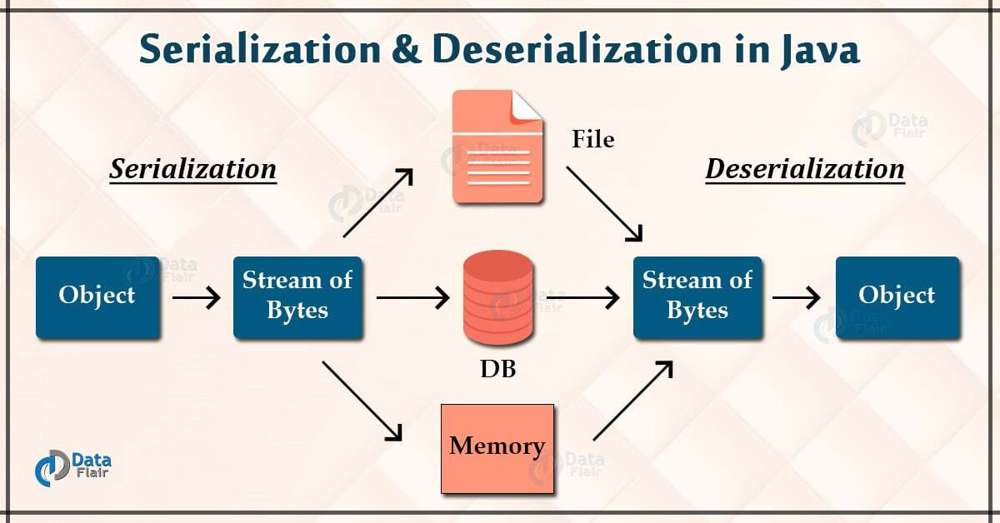

# What is Serialization and Deserialization in Java? 직렬화와 역직렬화

 

- `직렬화(Serialization)` : Java Object를 컴퓨터가 읽을 수 있게 하기 위해 바이트 형태로 변환하는 과정
- `역직렬화(Deserialization)` : 직렬화의 반대로, 바이트에서 데이터 객체로 변환하는 과정.

 

